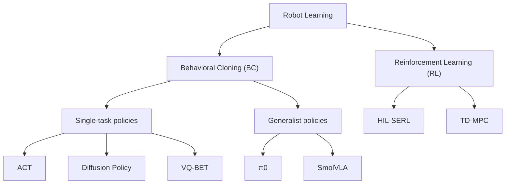

# Robot Learning 方法分类

> [!tip] 可编辑说明
> 下面是 ==Mermaid 流程图==(纯文本,Obsidian 直接渲染)。要改文字/加节点,直接编辑代码块即可:
> - 加一个方法:写一行 `父节点 --> 新节点["显示名"]`
> - 改显示名:改方括号 `["..."]` 里的字
> - 调方向:`flowchart TD`(上下)↔ `flowchart LR`(左右)



---

## 一句话注解

| 节点 | 是什么 |
|---|---|
| **Behavioral Cloning (BC)** | 监督学习,模仿示范数据(==遥操采的数据集就喂这里==) |
| ├ Single-task | 一个模型干一件事 |
| ├─ **ACT** | 分块预测动作,双臂精细操作标配(==起步首选==) |
| ├─ **Diffusion Policy** | 扩散模型建模动作分布,擅长多模态 |
| ├─ **VQ-BET** | 动作离散成 token 再预测 |
| ├ Generalist | 通用多任务,即 VLA(视觉-语言-动作) |
| ├─ **π0** | flow-matching VLA,大模型多任务 |
| └─ **SmolVLA** | 小型 VLA,==SO-ARM/消费级硬件友好== |
| **Reinforcement Learning (RL)** | 试错学习,靠奖励信号,真机探索成本高(后期再上) |
| ├─ **HIL-SERL** | 人在回路真机 RL,样本效率高 |
| └─ **TD-MPC** | 基于模型的 RL,潜空间动力学 + 预测控制 |
==注意事项：==

### （1）`save_freq` —— 控制"多久存一次模型"

> [!note] 它是什么
> `save_freq` 是训练配置里的一个参数,含义是 ==每训练多少个 step(步),就把当前模型存一次 checkpoint(检查点)到磁盘==。
> 比如 `save_freq=20000`,就是每 2 万步存一个模型;改成 `save_freq=5000`,就是每 5 千步存一个。

> [!important] 为什么"调小能更早看到模型"
> 训练是个长过程(动辄几万~几十万 step)。你==只有在它"存盘"的那一刻,磁盘上才会出现一个能拿去用的模型文件==(用于评估 / 部署到机械臂上试)。
> - `save_freq` ==大==(比如 2 万):要等很久才存第一个,中途想试效果没东西可用。
> - `save_freq` ==小==(比如 1~5 千):==很快就能拿到第一个 checkpoint==,提前部署看看策略大概学成什么样,不用干等整轮训练结束。
> 另一个好处:==训练中途崩了 / 断电==,能从最近一次 checkpoint 续训,少丢进度。

> [!caution] 代价(别无脑调太小)
> 存盘越频繁 → ==磁盘占用越大==(每个 checkpoint 是完整模型,几十 MB~几百 MB)、==I/O 开销越多==,训练会被存盘动作轻微拖慢。
> 经验:调小到==能尽早看到第一个可用模型==即可,不必小到每几百步存一次。也可配合"只保留最近 N 个"避免塞满硬盘。

### LeRobot 里在哪用到 `save_freq`

> [!info] 三个位置(以你 clone 的 Seeed 版为准,文件名各版本略有差异)
> 1. **配置定义**:训练配置类里(通常是 `lerobot/configs/train.py` 的 `TrainPipelineConfig`),有 `save_freq` 字段和默认值,旁边还有 `log_freq`(多久打一次日志)、`eval_freq`(多久评估一次)、`save_checkpoint`(是否存盘)。
> 2. **训练循环**:训练脚本(通常是 `lerobot/scripts/train.py`)里有类似
>    ```python
>    if cfg.save_checkpoint and step % cfg.save_freq == 0:
>        save_checkpoint(...)   # 把当前模型写到 outputs/.../checkpoints/
>    ```
>    ——就是这行用 ==取模判断==,每到 `save_freq` 的整数倍步就存一次。
> 3. **命令行覆盖**:启动训练时直接传参覆盖默认值,例如:
>    ```shell
>    python lerobot/scripts/train.py ... --save_freq=5000
>    ```
> checkpoint 默认存到 ==`outputs/train/<时间戳>/checkpoints/<步数>/`== 下,里面就是能加载来推理/部署的模型权重。

> [!tip] 一句话
> `save_freq` 调小 = ==存盘更勤 = 更早、更频繁地在磁盘上拿到可用模型==,代价是多占点磁盘和一点 I/O。和它配套看的还有 `eval_freq`(多久自动评估一次)和 `log_freq`(多久打一次训练日志)。