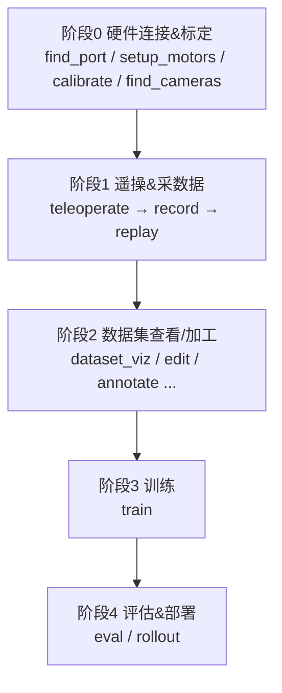

> [!abstract] 这篇讲什么
> 整理 LeRobot(Seeed 版)仓库 ==`scripts/` 文件夹==下所有命令行脚本:**它们各是干嘛的、按什么顺序用、两类脚本格式的区别**。
> 目标:先建立==总体概念==,再逐个深入。明天从这里接着看。

---

# scripts/ 脚本总览与工作流

## 〇、总体概念(先看这个)

> [!important] `scripts/` 是什么
> 它是 LeRobot 的 ==所有命令行入口(CLI)== 所在地。你和机械臂打交道的每一步——找端口、标定、遥操、采数据、训练、部署——==都是在这里跑一个脚本==。
> 每个 `lerobot_xxx.py` 都注册成了控制台命令 ==`lerobot-xxx`==(下划线变连字符),所以两种调用方式等价:
> - `lerobot-find-port`
> - `python -m lerobot.scripts.lerobot_find_port`

> [!warning] 脚本格式**不统一**,分两类(重要)
> | 类型 | 参数解析方式 | 代表 | 特点 |
> |---|---|---|---|
> | **配置驱动的大脚本** | `@parser.wrap()` + 配置 dataclass | `lerobot_train`、`record`、`teleoperate`、`eval` | 参数多,命令行 `--xxx` 直接对应 config 字段 |
> | **工具型小脚本** | 普通 `main()` 或标准 `argparse` | `find_port`、`find_cameras`、`setup_motors` | 参数少,常==交互式== |
>
> 想知道某个脚本能调哪些参数 → ==`lerobot-xxx --help`==。**这是最该养成的习惯。**

### 整体工作流(一张图)



---

## 一、按工作流顺序讲每个脚本

### 阶段 0:硬件连接 & 标定(接上机械臂第一步做)
| 脚本 | 作用 | 能干啥 / 典型用法 |
|---|---|---|
| ==`lerobot_find_port.py`== | 找机械臂插在哪个串口(COM 口)。==插拔对比法==,第一个要跑的 | 不知道臂插在 `COM3` 还是 `COM5` 时跑它。它让你拔一次 USB,自动报出消失的端口名。==双臂跑两次==,把主/从臂的端口分别记下来,后面所有命令都要填这个口 |
| `lerobot_setup_motors.py` | 给舵机==逐个写 ID==(飞特舵机出厂 ID 都一样,必须先配) | 新买的舵机 ID 默认全是 1,总线上会撞车。它带你==一个一个接、依次写入 1~N 的 ID==。组装新臂或换了新舵机时用 |
| `lerobot_setup_can.py` | 配 CAN 总线(部分机型用 CAN 而非串口) | 只有用 CAN 通信的机型(部分大臂)才需要。SO-ARM 这类走串口的==用不到,跳过== |
| ==`lerobot_calibrate.py`== | ==关节标定==,记录每个关节零位/范围,不标定动作会乱 | 带你把臂摆到==指定姿态(零位/中位)==,记录每个关节的编码器读数范围。==主臂和从臂都要标==;不标定会出现"主臂动一点从臂乱甩"。换舵机/重装后要重标 |
| `lerobot_find_joint_limits.py` | 探测关节物理限位 | 手动掰动每个关节到极限,记录==最大/最小角度==,防止后续运动超限撞坏。排查"某关节转不到位"时也用 |
| ==`lerobot_find_cameras.py`== | 列出可用摄像头、抓拍存图,确认索引 | 插了多个 USB 摄像头分不清哪个是哪个时跑它。它列出所有相机的 ==index== 并抓几张图存到 `outputs/captured_images/`,你开图就知道==哪个 index 对应左手/右手/俯视== |
| `lerobot_info.py` | 打印设备/数据集信息,排查用 | 快速查看某个数据集的==帧数/episode 数/特征维度==,或设备信息。出问题时先跑它看清现状 |

### 阶段 1:遥操作 & 采数据(核心环节)
| 脚本 | 作用 | 能干啥 / 典型用法 |
|---|---|---|
| ==`lerobot_teleoperate.py`== | ==遥操==:主动臂带动从动臂,先空跑确认硬件 OK | 你手动掰==主动臂(leader)==,==从动臂(follower)实时跟随==。采数据前先用它==空跑==:确认端口、标定、跟随方向都对,屏幕能看到摄像头画面。**不存数据,纯试手感** |
| ==`lerobot_record.py`== | ==录制数据集==:一边遥操一边把"观测+动作+视频"存成 LeRobotDataset。**这步产出训练数据** | 遥操的同时==按 episode 录制==:每条轨迹存下"摄像头视频 + 关节状态 + 动作 + 任务描述"。可设录几条、每条多长、自动重置。==这是整个项目的数据来源==,产物直接喂阶段3训练 |
| `lerobot_replay.py` | 把录好的某条轨迹==回放==到机械臂上,验证数据对不对 | 选数据集里某条 episode,让从动臂==照着录的动作复现一遍==。用来检查"录的数据是不是干净/对得上",或演示某条轨迹 |

### 阶段 2:数据集查看 / 加工
| 脚本 | 作用 | 能干啥 / 典型用法 |
|---|---|---|
| `lerobot_dataset_viz.py` | ==可视化数据集==(看每条 episode 的画面+动作曲线) | 在浏览器/窗口里==逐帧回看==每条 episode:摄像头画面 + 各关节动作曲线对齐显示。采完数据==第一件事就是用它检查质量==(有没有抖、有没有空录) |
| `lerobot_edit_dataset.py` | 编辑数据集(删坏的 episode、改 meta 等) | ==删掉录坏的 episode==、合并/拆分、改任务描述等元信息。清洗数据用,别让坏样本污染训练 |
| `lerobot_annotate.py` | 给数据==打标注/语言指令==(VLA 训练需要) | 给每条 episode 配==自然语言指令==(如"把红色方块放进盒子")。训 ==SmolVLA / π0 这类带语言的模型==前必须做;纯 ACT 可不做 |
| `lerobot_imgtransform_viz.py` | 预览图像增强(裁剪/色彩抖动)的效果 | 训练前==预览数据增强长啥样==(裁剪、亮度/色彩抖动等),调参时确认增强没把画面弄坏 |
| `convert_dataset_v21_to_v30.py` | ==数据集格式版本转换==(老 v2.1 → 新 v3.0) | 拿到==别人早期录的旧格式数据集==、新版 LeRobot 读不了时,用它升级到 v3.0。自己新录的不用管 |
| `augment_dataset_quantile_stats.py` | 重算/增强数据集的归一化统计量 | 重新计算数据集的==归一化统计量(分位数)==。合并数据集后或归一化异常时用,保证训练输入尺度正确 |
| `lerobot_train_tokenizer.py` | 训练 tokenizer(给 VQ-BET / VLA 这类用) | 给 ==VQ-BET / VLA== 这类需要把动作/输入==离散成 token== 的方法,先训练一个 tokenizer。训 ACT/Diffusion ==用不到== |

### 阶段 3:训练
| 脚本 | 作用 | 能干啥 / 典型用法 |
|---|---|---|
| ==`lerobot_train.py`== | ==训练策略模型==(ACT / Diffusion / SmolVLA 等)。`save_freq` 就在这(见另一篇笔记) | 喂阶段1录的数据集,==训练出能控制机械臂的策略模型==。命令行指定 `--policy.type=act/diffusion/...`、数据集、训练步数、`save_freq` 等;过程中按 `save_freq` 往 `outputs/.../checkpoints/` 存模型,可 `--resume` 续训 |

### 阶段 4:评估 & 部署
| 脚本 | 作用 | 能干啥 / 典型用法 |
|---|---|---|
| `lerobot_eval.py` | 在==仿真环境==里批量评估 checkpoint 的成功率 | 拿训好的 checkpoint 在==仿真环境==里跑很多回合,算==成功率(pc_success)、平均奖励==。用来横向比较不同 checkpoint/不同模型谁更强(需要有对应仿真 env) |
| ==`lerobot_rollout.py`== | 把训好的策略==真正跑起来==(真机/环境上推理执行) | 加载训好的模型,让==机械臂自己执行任务==(真机推理)。这是"采数据→训练"后==见证成果的一步==:模型自主完成你教它的动作 |

---

## 二、已精读脚本的细节(逐个补充)

### `lerobot_find_port.py` —— 插拔对比法
逻辑:
```
1. 列出当前所有串口(before)
2. 提示「拔掉 USB,按 Enter」
3. sleep 0.5s 等系统释放端口
4. 再列一次(after)
5. before - after = 消失的那个口 = 你机械臂的口
```
判断三种情况:==恰好 1 个差异== → 打印端口名 ✅;0 个 → 报错"没检测到变化"(没真拔);>1 个 → 报错"检测到多个"(拔时别插拔别的 USB)。

> [!note] 学习要点
> - ==交互式==脚本(`input()` 等你按 Enter),不能后台自动跑。
> - Windows 给 ==`COM3`== 这种;Linux 给 `/dev/ttyACM0`。
> - **双臂两块控制板就跑两次**,分别记录端口。
> - 需要 `pyserial`(代码 `require_package("pyserial", extra="hardware")`)。

### `lerobot_find_cameras.py` —— 检测 + 抓拍存图
做两件事:
1. **检测打印**:找 ==OpenCV 相机==(==你的 200万 USB 摄像头属于这类==)和 RealSense 深度相机(没装 `pyrealsense2` 会跳过,==你没这种相机,warning 正常忽略==),打印每个的 ==index/id==、分辨率、FPS。
2. **抓拍存图**:连上相机,在 `--record-time-s`(默认 ==6 秒==)内多线程抓帧,存 PNG 到 ==`outputs/captured_images/`==。

CLI 参数(argparse):位置参 `camera_type`(`opencv`/`realsense`,不填=都找)、`--output-dir`、`--record-time-s`。

> [!note] 学习要点
> - ==它不是开实时视频窗口,而是抓快照存盘==,去 `outputs/captured_images/` 打开 PNG 看。
> - **最重要的产出 = 每个相机的 index/id**,后面 `record`/`teleoperate` 配相机要填。
> - 多个相同 USB 摄像头时,靠存出的图分辨哪个 index 对应左手/右手/俯视。

---

## 三、学习路线

> 接硬件 → ==`find_port` → `setup_motors` → `calibrate` → `find_cameras`==(阶段0)→ ==`teleoperate`== 空跑 → ==`record`== 采数据 → `dataset_viz` 检查 → ==`train`== → `rollout` 部署。

> [!tip] 新手第一周
> 只碰这 5 个:==`find_port`、`setup_motors`、`calibrate`、`teleoperate`、`record`==,把"采数据"打通,训练自然水到渠成。

---

> [!todo] 待补充(明天接着拆)
> - [ ] `lerobot_setup_motors.py`(舵机写 ID)
> - [ ] `lerobot_calibrate.py`(关节标定)
> - [ ] `lerobot_record.py`(录数据集)
