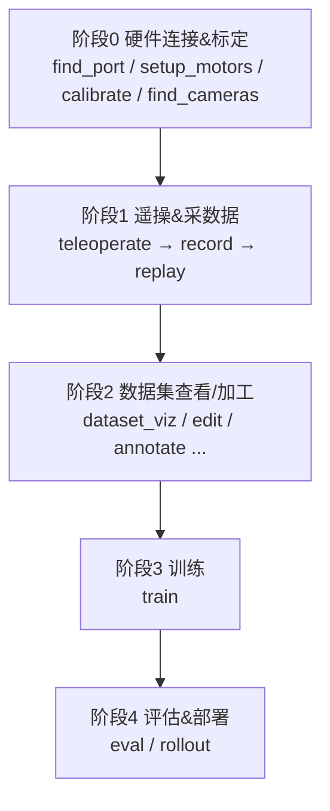

> [!abstract] 这篇讲什么
> 整理 LeRobot(Seeed 版)仓库 ==`scripts/` 文件夹==下所有命令行脚本:**它们各是干嘛的、按什么顺序用、两类脚本格式的区别**。
> 目标:先建立==总体概念==,再逐个深入。明天从这里接着看。

---

# scripts/ 脚本总览与工作流

## 〇、总体概念(先看这个)

> [!important] `scripts/` 是什么
> 它是 LeRobot 的 ==所有命令行入口(CLI)== 所在地。你和机械臂打交道的每一步——找端口、标定、遥操、采数据、训练、部署——==都是在这里跑一个脚本==。
> 每个 `lerobot_xxx.py` 都注册成了控制台命令 ==`lerobot-xxx`==(下划线变连字符),所以两种调用方式等价:
> - `lerobot-find-port`
> - `python -m lerobot.scripts.lerobot_find_port`

> [!warning] 脚本格式**不统一**,分两类(重要)
> | 类型 | 参数解析方式 | 代表 | 特点 |
> |---|---|---|---|
> | **配置驱动的大脚本** | `@parser.wrap()` + 配置 dataclass | `lerobot_train`、`record`、`teleoperate`、`eval` | 参数多,命令行 `--xxx` 直接对应 config 字段 |
> | **工具型小脚本** | 普通 `main()` 或标准 `argparse` | `find_port`、`find_cameras`、`setup_motors` | 参数少,常==交互式== |
>
> 想知道某个脚本能调哪些参数 → ==`lerobot-xxx --help`==。**这是最该养成的习惯。**

### 整体工作流(一张图)



---

## 一、按工作流顺序讲每个脚本

### 阶段 0:硬件连接 & 标定(接上机械臂第一步做)
| 脚本 | 作用 |
|---|---|
| ==`lerobot_find_port.py`== | 找机械臂插在哪个串口(COM 口)。==插拔对比法==,第一个要跑的 |
| `lerobot_setup_motors.py` | 给舵机==逐个写 ID==(飞特舵机出厂 ID 都一样,必须先配) |
| `lerobot_setup_can.py` | 配 CAN 总线(部分机型用 CAN 而非串口) |
| ==`lerobot_calibrate.py`== | ==关节标定==,记录每个关节零位/范围,不标定动作会乱 |
| `lerobot_find_joint_limits.py` | 探测关节物理限位 |
| ==`lerobot_find_cameras.py`== | 列出可用摄像头、抓拍存图,确认索引 |
| `lerobot_info.py` | 打印设备/数据集信息,排查用 |

### 阶段 1:遥操作 & 采数据(核心环节)
| 脚本 | 作用 |
|---|---|
| ==`lerobot_teleoperate.py`== | ==遥操==:主动臂带动从动臂,先空跑确认硬件 OK |
| ==`lerobot_record.py`== | ==录制数据集==:一边遥操一边把"观测+动作+视频"存成 LeRobotDataset。**这步产出训练数据** |
| `lerobot_replay.py` | 把录好的某条轨迹==回放==到机械臂上,验证数据对不对 |

### 阶段 2:数据集查看 / 加工
| 脚本 | 作用 |
|---|---|
| `lerobot_dataset_viz.py` | ==可视化数据集==(看每条 episode 的画面+动作曲线) |
| `lerobot_edit_dataset.py` | 编辑数据集(删坏的 episode、改 meta 等) |
| `lerobot_annotate.py` | 给数据==打标注/语言指令==(VLA 训练需要) |
| `lerobot_imgtransform_viz.py` | 预览图像增强(裁剪/色彩抖动)的效果 |
| `convert_dataset_v21_to_v30.py` | ==数据集格式版本转换==(老 v2.1 → 新 v3.0) |
| `augment_dataset_quantile_stats.py` | 重算/增强数据集的归一化统计量 |
| `lerobot_train_tokenizer.py` | 训练 tokenizer(给 VQ-BET / VLA 这类用) |

### 阶段 3:训练
| 脚本 | 作用 |
|---|---|
| ==`lerobot_train.py`== | ==训练策略模型==(ACT / Diffusion / SmolVLA 等)。`save_freq` 就在这(见另一篇笔记) |

### 阶段 4:评估 & 部署
| 脚本 | 作用 |
|---|---|
| `lerobot_eval.py` | 在==仿真环境==里批量评估 checkpoint 的成功率 |
| ==`lerobot_rollout.py`== | 把训好的策略==真正跑起来==(真机/环境上推理执行) |

---

## 二、已精读脚本的细节(逐个补充)

### `lerobot_find_port.py` —— 插拔对比法
逻辑:
```
1. 列出当前所有串口(before)
2. 提示「拔掉 USB,按 Enter」
3. sleep 0.5s 等系统释放端口
4. 再列一次(after)
5. before - after = 消失的那个口 = 你机械臂的口
```
判断三种情况:==恰好 1 个差异== → 打印端口名 ✅;0 个 → 报错"没检测到变化"(没真拔);>1 个 → 报错"检测到多个"(拔时别插拔别的 USB)。

> [!note] 学习要点
> - ==交互式==脚本(`input()` 等你按 Enter),不能后台自动跑。
> - Windows 给 ==`COM3`== 这种;Linux 给 `/dev/ttyACM0`。
> - **双臂两块控制板就跑两次**,分别记录端口。
> - 需要 `pyserial`(代码 `require_package("pyserial", extra="hardware")`)。

### `lerobot_find_cameras.py` —— 检测 + 抓拍存图
做两件事:
1. **检测打印**:找 ==OpenCV 相机==(==你的 200万 USB 摄像头属于这类==)和 RealSense 深度相机(没装 `pyrealsense2` 会跳过,==你没这种相机,warning 正常忽略==),打印每个的 ==index/id==、分辨率、FPS。
2. **抓拍存图**:连上相机,在 `--record-time-s`(默认 ==6 秒==)内多线程抓帧,存 PNG 到 ==`outputs/captured_images/`==。

CLI 参数(argparse):位置参 `camera_type`(`opencv`/`realsense`,不填=都找)、`--output-dir`、`--record-time-s`。

> [!note] 学习要点
> - ==它不是开实时视频窗口,而是抓快照存盘==,去 `outputs/captured_images/` 打开 PNG 看。
> - **最重要的产出 = 每个相机的 index/id**,后面 `record`/`teleoperate` 配相机要填。
> - 多个相同 USB 摄像头时,靠存出的图分辨哪个 index 对应左手/右手/俯视。

---

## 三、学习路线

> 接硬件 → ==`find_port` → `setup_motors` → `calibrate` → `find_cameras`==(阶段0)→ ==`teleoperate`== 空跑 → ==`record`== 采数据 → `dataset_viz` 检查 → ==`train`== → `rollout` 部署。

> [!tip] 新手第一周
> 只碰这 5 个:==`find_port`、`setup_motors`、`calibrate`、`teleoperate`、`record`==,把"采数据"打通,训练自然水到渠成。

---

> [!todo] 待补充(明天接着拆)
> - [ ] `lerobot_setup_motors.py`(舵机写 ID)
> - [ ] `lerobot_calibrate.py`(关节标定)
> - [ ] `lerobot_record.py`(录数据集)
